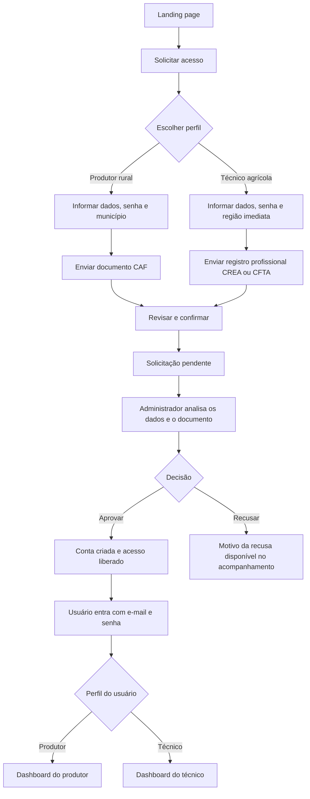
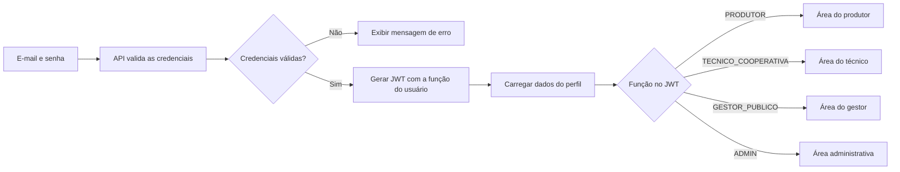

<div align="center">
  

  <h3>Inteligência agrícola para decisões mais seguras no campo</h3>

  <p>
    Uma plataforma que reúne dados de chuva, produtividade e território para
    apoiar produtores rurais, técnicos agrícolas e gestores públicos do Ceará.
  </p>

  <p>
    
    
    
    
  </p>
</div>

---

## Prévia da aplicação

<p align="center">
  
</p>

## Sobre o projeto

O **Chuva & Safra** é uma plataforma de análise agrícola criada para transformar
dados climáticos e produtivos em informações acessíveis para quem atua no campo.
O sistema considera o território e o perfil de cada usuário para entregar recortes
compatíveis com sua área de atuação.

A aplicação atende quatro perfis:

- **Produtor rural:** acompanha informações do município associado ao cadastro.
- **Técnico agrícola:** compara municípios pertencentes à sua região imediata.
- **Gestor público:** visualiza o panorama agrícola do estado do Ceará.
- **Administrador:** gerencia usuários e solicitações de acesso.

## Principais funcionalidades

- Autenticação com JWT e segregação de acesso por perfil.
- Solicitação de acesso para produtores e técnicos.
- Aprovação e recusa de solicitações pela área administrativa.
- Consulta do andamento da solicitação por protocolo.
- Análises de chuva, produtividade e culturas agrícolas.
- Filtros por cultura, período, município e região de atuação.
- Visualizações interativas e indicadores agrícolas.
- Integração com dados territoriais e agrícolas do IBGE/SIDRA.
- Interface responsiva alinhada à identidade visual do Chuva & Safra.

## Fluxo de solicitação e acesso



Durante a análise, o solicitante pode consultar o andamento usando o protocolo
gerado no envio. A autenticação só é liberada após a aprovação administrativa.

### Entrada de usuários já aprovados



## Arquitetura

O projeto utiliza uma estrutura de **monorepo** com npm workspaces:

```text
chuva-e-safra/
├── apps/
│   ├── web/          # Interface em Next.js
│   └── backend/      # API REST em Express
├── package.json
└── package-lock.json
```

O frontend consome a API REST do projeto. O backend centraliza autenticação,
regras de acesso, consultas agrícolas e persistência dos dados por meio do Prisma.

<h2>Tecnologias</h2>

<kbd>
  <kbd>Front-end</kbd>
  <br><br>
  <p align="center">
    
    <br><br>
    
    &nbsp;&nbsp;
    
  </p>
</kbd>

<br><br>

<kbd>
  <kbd>Back-end</kbd>
  <br><br>
  <p align="center">
    
    <br><br>
    
    &nbsp;&nbsp;
    
  </p>
</kbd>

<br><br>

<kbd>
  <kbd>Dados e integrações</kbd>
  <br><br>
  <p align="center">
    
  </p>
</kbd>

## Infraestrutura

<table>
  <tr>
    <td align="center" width="33%">
      
      <br />
      <strong>Vercel</strong>
      <br />
      Frontend Next.js
    </td>
    <td align="center" width="33%">
      
      <br />
      <strong>Render</strong>
      <br />
      API e serviços do backend
    </td>
    <td align="center" width="33%">
      
      <br />
      <strong>Supabase</strong>
      <br />
      Banco de dados PostgreSQL
    </td>
  </tr>
</table>

## Uso

Para configurar o ambiente de desenvolvimento, preparar o banco de dados,
consultar as tabelas e executar os scripts do projeto, acesse o
[Tutorial de configuração](./TUTORIAL.md).

## Equipe

<table>
  <tr>
    <td align="center" width="16.66%">
      
      <br />
      <strong>Davi Castro</strong>
    </td>
    <td align="center" width="16.66%">
      
      <br />
      <strong>Daniel Verissimo</strong>
    </td>
    <td align="center" width="16.66%">
      
      <br />
      <strong>Anthony Eduardo</strong>
    </td>
    <td align="center" width="16.66%">
      
      <br />
      <strong>Daniel Gomes</strong>
    </td>
    <td align="center" width="16.66%">
      
      <br />
      <strong>Sara</strong>
    </td>
    <td align="center" width="16.66%">
      
      <br />
      <strong>Lucas Gabriel</strong>
    </td>
  </tr>
  <tr>
    <td align="center"><a href="https://br.linkedin.com/in/davigcastro">LinkedIn</a></td>
    <td align="center"><a href="https://br.linkedin.com/in/daniel-verissimo">LinkedIn</a></td>
    <td align="center"><a href="https://br.linkedin.com/in/anthony-eduardo-barros">LinkedIn</a></td>
    <td align="center"><a href="https://www.linkedin.com/in/daniel-freitas-5b23b540a/">LinkedIn</a></td>
    <td align="center"><a href="https://www.linkedin.com/in/sara-queiroz-%F0%9F%91%A9%F0%9F%8F%BD%E2%80%8D%F0%9F%92%BB-aa8a40420/">LinkedIn</a></td>
    <td align="center"><a href="https://www.linkedin.com/in/lucas-gabriel-71165332b/">LinkedIn</a></td>
  </tr>
  <tr>
    <td align="center"><a href="https://github.com/Davi-santos16">GitHub</a></td>
    <td align="center"><a href="https://github.com/DanielVerissimo1">GitHub</a></td>
    <td align="center"><a href="https://github.com/anthonyeduardob">GitHub</a></td>
    <td align="center"><a href="https://github.com/danielfgsdev">GitHub</a></td>
    <td align="center"><a href="https://github.com/sarinhaqueirozzz">GitHub</a></td>
    <td align="center"><a href="https://github.com/Dev-Lucas-Gabriel">GitHub</a></td>
  </tr>
</table>

---

<p align="center">
  Desenvolvido para aproximar tecnologia, dados e agricultura no Ceará.
</p>
